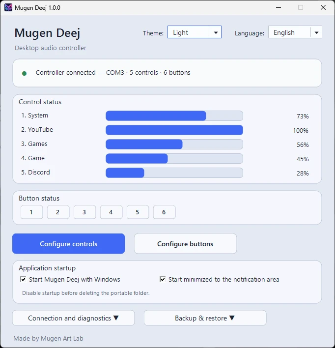
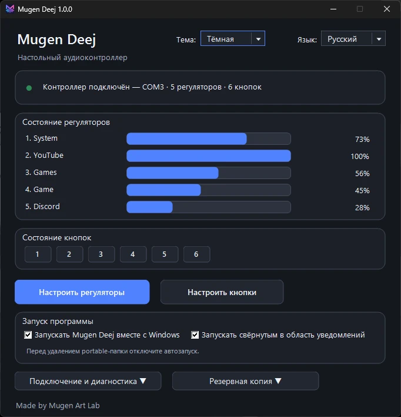
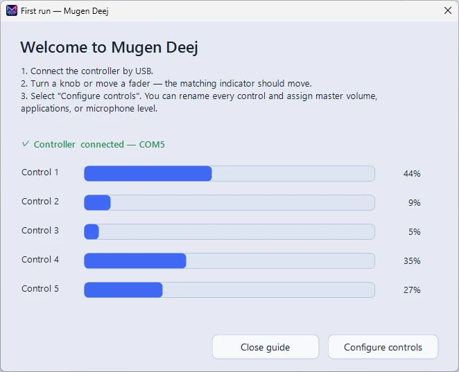
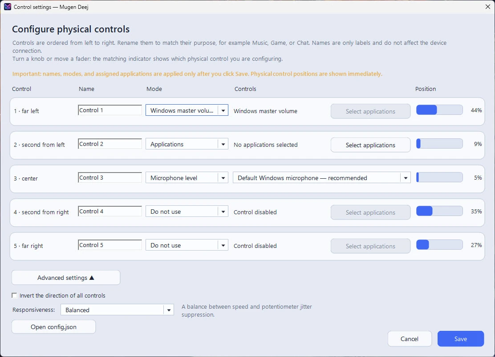
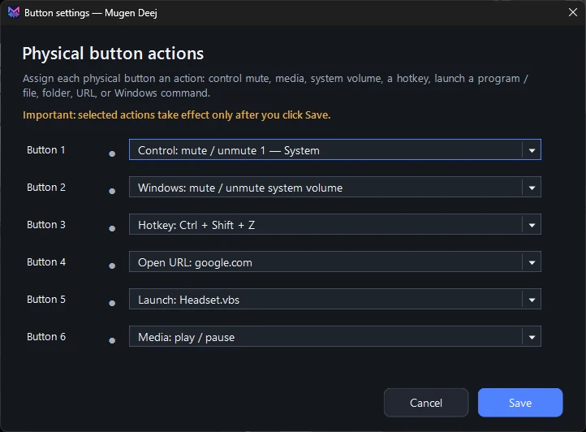
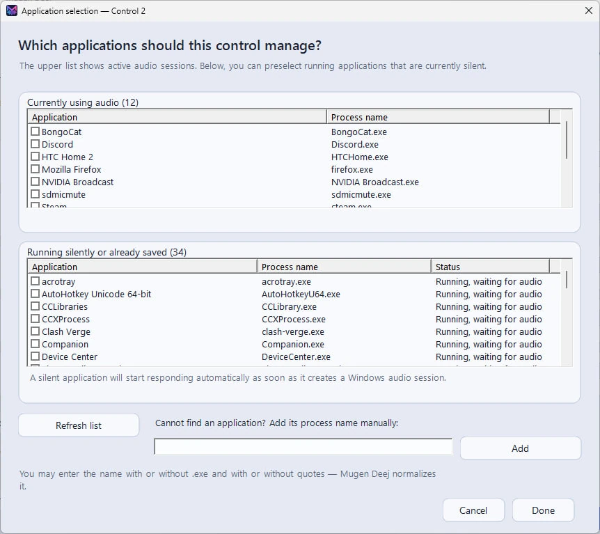
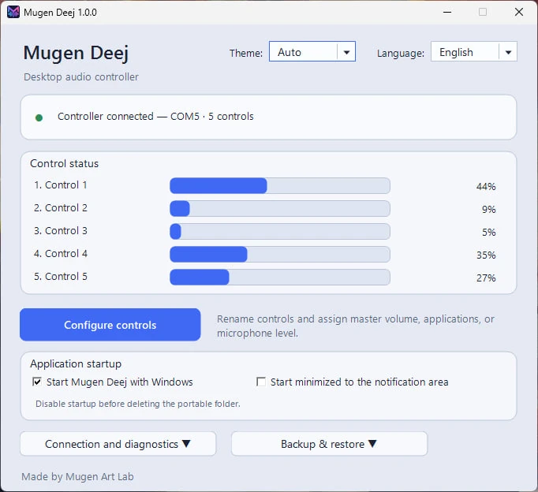
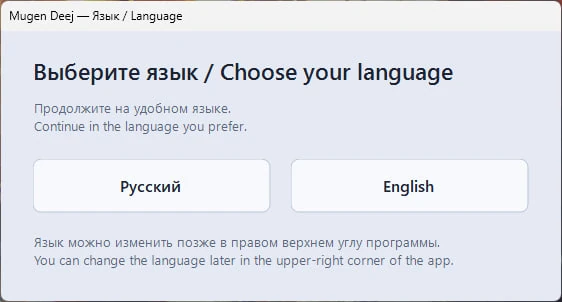

<p align="center">
  
</p>

<h1 align="center">Mugen Deej</h1>

<p align="center">
  A bilingual Windows client for deej-compatible USB audio controllers.
</p>

<p align="center">
  <a href="README_RU.md">Русский</a> · <strong>English</strong>
</p>

<p align="center">
  <a href="assets/screenshots/en/main-window-extended.webp">
    
  </a>
  <a href="assets/screenshots/en/main-window-extended-dark.webp">
    
  </a>
</p>

## Relationship to the original deej project

Mugen Deej is an independently developed Windows client inspired by and compatible with the original [deej](https://github.com/omriharel/deej) project created by Omri Harel.

It follows the same general idea of a physical volume mixer and accepts a compatible newline-delimited serial format. The Mugen Deej desktop client, interface, diagnostics, and connection logic were developed separately for this project.
Mugen Deej is **not a fork of the original desktop client**, does not bundle the original `deej.exe`, and is not an official continuation of or affiliated with the original deej project. Full acknowledgement is available in [THIRD_PARTY_NOTICES.md](THIRD_PARTY_NOTICES.md).

## What it does

Mugen Deej turns a deej-compatible USB serial controller with physical controls into a friendly Windows volume mixer.

- Automatically discovers compatible controllers across COM ports.
- Reconnects after USB disconnects, resets, and COM-port changes.
- Supports automatic discovery and manual port selection.
- Supports both **Legacy** controllers with physical sliders/knobs only and **Extended** controllers with additional buttons.
- Shows live positions for five physical controls by default.
- Controls Windows master volume, one or more applications, the default microphone, or a selected input device.
- Lets silent applications be assigned before they create an audio session.
- Lets Extended-controller buttons perform actions such as soft mute, media play/pause, or launching a file/program.
- Can start with Windows and optionally launch directly to the notification area.
- Includes **Auto, Light, and Dark** themes; Auto follows Windows theme changes while the app is running.
- Includes Russian and English interfaces and a first-run guide.
- Can back up and restore the application configuration, including button assignments.
- Provides clearer diagnostics for busy ports, driver problems, and rare COM-number conflicts.
- Ships both as a self-contained Setup EXE and as a portable ZIP.

## Interface tour

Mugen Deej adapts its main window to the detected controller. Extended firmware can expose buttons in addition to physical volume controls, while Legacy firmware keeps the simpler controls-only layout. Click any screenshot to view it at full size.

### First-run guide

Connect the controller, move a physical control, and immediately see which input is being detected.

<p align="center">
  <a href="assets/screenshots/en/first-run.webp">
    
  </a>
</p>

### Configure physical controls

Rename each control and assign Windows master volume, applications, a microphone, or disable it entirely.

<p align="center">
  <a href="assets/screenshots/en/control-settings.webp">
    
  </a>
</p>

### Configure Extended-controller buttons

When the connected firmware exposes buttons, assign actions such as soft mute, media play/pause, or launching a file/program.

<p align="center">
  <a href="assets/screenshots/en/button-settings.webp">
    
  </a>
</p>

### Select active or currently silent applications

Choose applications that already have an audio session or preselect running applications before they play any sound.

<p align="center">
  <a href="assets/screenshots/en/application-selection.webp">
    
  </a>
</p>

<details>
<summary><strong>Legacy controller without buttons</strong></summary>
<br>
Mugen Deej automatically adapts its interface to the detected controller protocol. Legacy controllers expose physical controls only, while Extended controllers can additionally provide buttons.
<br><br>
<p align="center">
  <a href="assets/screenshots/en/main-window-legacy.webp">
    
  </a>
</p>
</details>

<details>
<summary><strong>Choose the interface language on first launch</strong></summary>
<br>
<p align="center">
  <a href="assets/screenshots/language-selection.webp">
    
  </a>
</p>
</details>

## Download

[Download the latest release](https://github.com/Mugen-Art-Lab/Mugen-Deej/releases/latest).

For most users, use the **Setup EXE**. It performs a portable-style installation and does not register Mugen Deej in Windows Installed Apps. A **portable ZIP** is also provided if you prefer to extract and run the application manually.

Current tested build: **1.0.0**.

## Controller protocol

A Legacy controller sends newline-terminated values such as:

```text
107|246|536|665|1020
```

The default configuration expects five values in the `0–1023` range at `9600` baud. Extended firmware can additionally expose button input; Mugen Deej detects the supported controller mode automatically.

## Quick start

1. Connect a deej-compatible controller by USB.
2. Run the Setup EXE, or extract the portable ZIP and run `MugenDeej.exe`.
3. Choose the interface language.
4. Open **Configure controls** and assign each physical control.
5. If an Extended controller with buttons is detected, open **Configure buttons** to assign button actions.

## Source layout

- `MugenDeej.ps1` — application UI, serial discovery, Core Audio control, diagnostics.
- `src/launcher/` — small Go launcher used for the Windows executable.
- `src/setup/` — self-contained Setup wrapper and bilingual installer UI.
- `config.example.json` — clean default configuration example.
- `docs/` — building, troubleshooting, and release notes.

## Requirements

- Windows 10 or Windows 11.
- Windows PowerShell 5.1 or newer.
- A deej-compatible USB serial controller.
- A suitable USB-serial driver for the controller, such as CH340/CH341 or FTDI.

## Building

See [docs/BUILDING.md](docs/BUILDING.md). The release builder produces both the portable ZIP and the self-contained Setup EXE.

## Contributing

Bug reports and focused pull requests are welcome. Please read [CONTRIBUTING.md](CONTRIBUTING.md) before submitting changes.

## License

MIT © 2026 MrSoichi / Mugen Art Lab. See [LICENSE](LICENSE) and [THIRD_PARTY_NOTICES.md](THIRD_PARTY_NOTICES.md).
