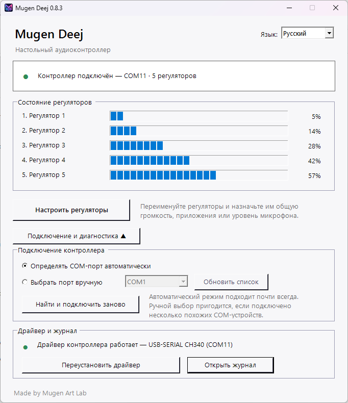

<p align="center">
  
</p>

<h1 align="center">Mugen Deej</h1>

<p align="center">
  A portable bilingual Windows client for deej-compatible USB audio controllers.
</p>

<p align="center">
  <a href="README_RU.md">Русский</a> · <strong>English</strong>
</p>



## Relationship to the original deej project

Mugen Deej is an independently developed Windows client inspired by and compatible with the original [deej](https://github.com/omriharel/deej) project created by Omri Harel.

It follows the same general idea of an Arduino-based physical volume mixer and accepts a compatible newline-delimited serial format. The Mugen Deej desktop client, interface, diagnostics, connection logic, and bundled reference firmware were developed separately for this project.

Mugen Deej is **not a fork of the original desktop client**, does not bundle the original `deej.exe`, and is not an official continuation of or affiliated with the original deej project. Full acknowledgement is available in [THIRD_PARTY_NOTICES.md](THIRD_PARTY_NOTICES.md).

## What it does

Mugen Deej turns a simple Arduino-based controller with knobs, faders, or other analog controls into a friendly Windows volume mixer.

- Automatically discovers compatible controllers across COM ports.
- Reconnects after USB disconnects, resets, and COM-port changes.
- Supports automatic discovery and manual port selection.
- Shows live positions for five physical controls by default.
- Controls Windows master volume, one or more applications, the default microphone, or a selected input device.
- Lets silent applications be assigned before they create an audio session.
- Includes Russian and English interfaces and a first-run guide.
- Provides clearer diagnostics for busy ports, driver problems, and rare COM-number conflicts.
- Runs portably without an installer.

## Download

Download the current portable build from the repository's **Releases** page, extract it, and run `MugenDeej.exe`.

Current tested build: **0.8.3**.

## Controller protocol

The controller sends newline-terminated values such as:

```text
107|246|536|665|1020
```

The default configuration expects five values in the `0–1023` range at `9600` baud.

## Quick start

1. Flash `firmware/MugenDeej_Nano_RGB.ino` or use a compatible deej sketch.
2. Connect the controller by USB.
3. Run `MugenDeej.exe` from the release archive.
4. Choose the interface language.
5. Open **Configure controls** and assign each physical control.

## Source layout

- `MugenDeej.ps1` — application UI, serial discovery, Core Audio control, diagnostics.
- `src/launcher/` — small Go launcher used for the Windows executable.
- `firmware/` — reference Arduino Nano firmware for five controls and WS2812 indicators.
- `config.example.json` — clean default configuration example.
- `docs/` — building, troubleshooting, and release notes.

## Requirements

- Windows 10 or Windows 11.
- Windows PowerShell 5.1 or newer.
- A deej-compatible USB serial controller.
- A suitable USB-serial driver for the controller, such as CH340/CH341 or FTDI.

## Building

See [docs/BUILDING.md](docs/BUILDING.md). The current portable release contains a launcher with the Mugen Deej icon embedded in the executable.

## Contributing

Bug reports and focused pull requests are welcome. Please read [CONTRIBUTING.md](CONTRIBUTING.md) before submitting changes.

## License

MIT © 2026 MrSoichi / Mugen Art Lab. See [LICENSE](LICENSE) and [THIRD_PARTY_NOTICES.md](THIRD_PARTY_NOTICES.md).
