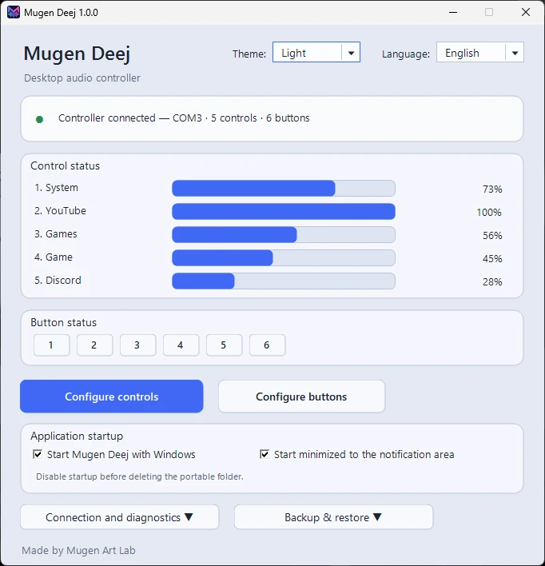
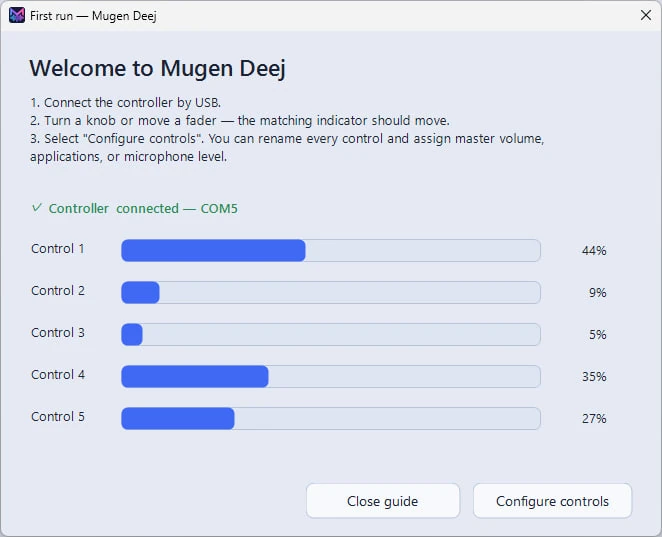
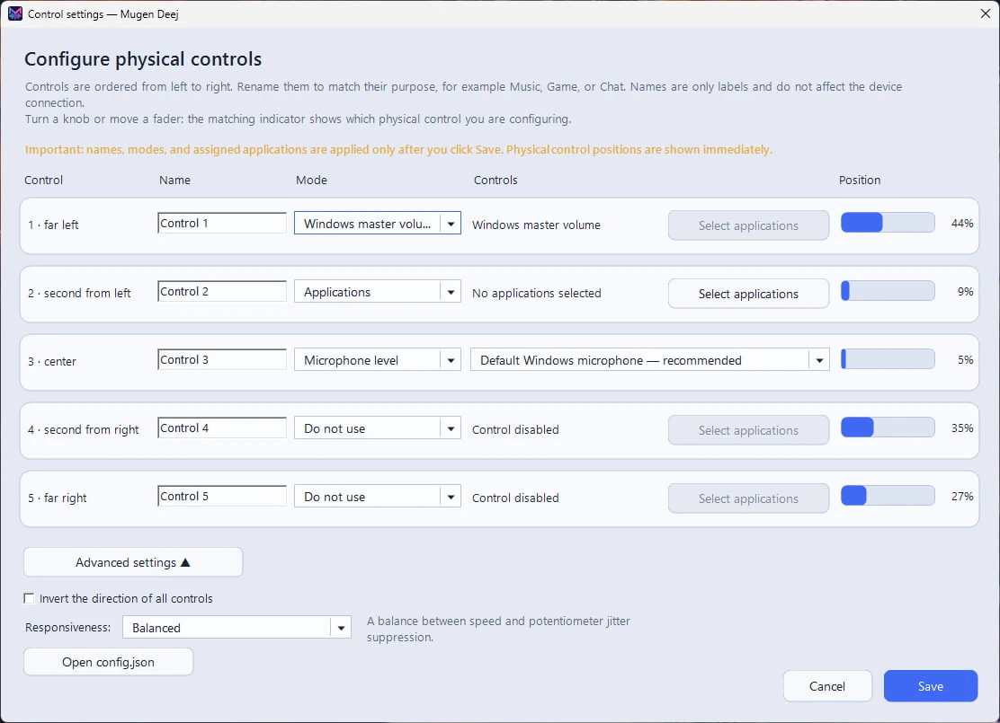
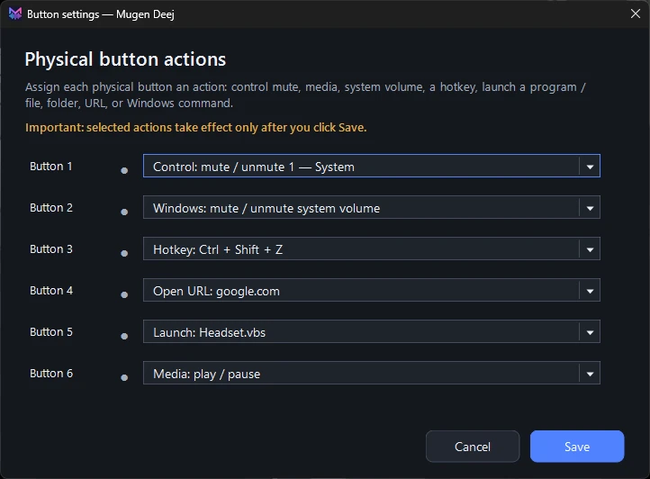
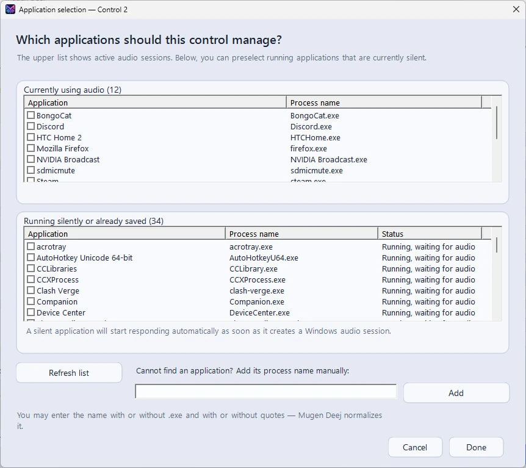
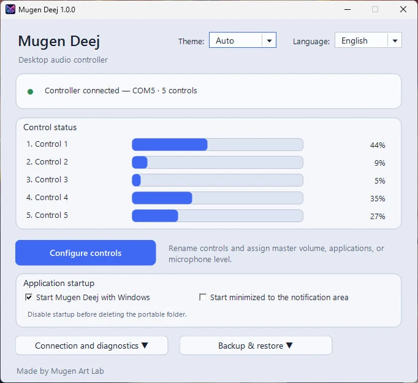
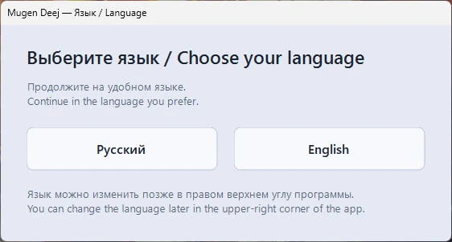

<p align="center">
  
</p>

<h1 align="center">Mugen Deej</h1>

<p align="center">
  A bilingual Windows client for deej-compatible USB audio controllers.
</p>

<p align="center">
  <a href="README_RU.md">Русский</a> · <strong>English</strong>
</p>

<p align="center">
  <a href="assets/screenshots/en/main-window-extended.webp">
    
  </a>
  <a href="assets/screenshots/en/main-window-extended-dark.webp">
    
  </a>
</p>

## Relationship to the original deej project

Mugen Deej is an independently developed Windows client inspired by and compatible with the original [deej](https://github.com/omriharel/deej) project created by Omri Harel.

It follows the same general idea of a physical volume mixer and accepts a compatible newline-delimited serial format. The Mugen Deej desktop client, interface, diagnostics, and connection logic were developed separately for this project.
Mugen Deej is **not a fork of the original desktop client**, does not bundle the original `deej.exe`, and is not an official continuation of or affiliated with the original deej project. Full acknowledgement is available in [THIRD_PARTY_NOTICES.md](THIRD_PARTY_NOTICES.md).

## What it does

Mugen Deej turns a deej-compatible USB serial controller with physical controls into a friendly Windows volume mixer.

- Automatically discovers compatible controllers across COM ports.
- Reconnects after USB disconnects, resets, and COM-port changes.
- Supports automatic discovery and manual port selection.
- Supports **Legacy**, **Extended**, and self-describing **Adaptive v3** controllers.
- Shows live analog-control positions and adapts the interface to the detected controller topology.
- Controls Windows master volume, one or more applications, the default microphone, or a selected input device.
- Lets you assign running applications before they start playing audio.
- Lets physical buttons mute or unmute assigned controls, send media commands and hotkeys, launch files or programs, and more.
- Can start with Windows and optionally launch directly to the notification area.
- Includes **Auto, Light, and Dark** themes; Auto follows Windows theme changes while the app is running.
- Includes Russian and English interfaces and a first-run guide.
- Adaptive v3 adds toggle/encoder actions, application profiles, Control layers, and an optional virtual Xbox 360 / XInput gamepad.
- Uses backup format v3 to store the main configuration, button actions, Adaptive mappings/layers, and virtual-controller settings together.
- Ships both as a self-contained Setup EXE and as a portable ZIP.

## Interface tour

Mugen Deej adapts its main window to the detected controller. Legacy firmware keeps the simpler controls-only layout, Extended can add buttons, and Adaptive v3 can expose sliders, buttons, toggles, and encoders. Click any screenshot to view it at full size.

### First-run guide

Connect the controller, move a physical control, and immediately see which input is being detected.

<p align="center">
  <a href="assets/screenshots/en/first-run.webp">
    
  </a>
</p>

### Configure physical controls

Rename each control and assign Windows master volume, applications, a microphone, or disable it entirely.

<p align="center">
  <a href="assets/screenshots/en/control-settings.webp">
    
  </a>
</p>

### Configure physical button actions

When the connected firmware exposes buttons, assign desktop actions or optional virtual Xbox 360 / XInput mappings.

<p align="center">
  <a href="assets/screenshots/en/button-settings.webp">
    
  </a>
</p>

### Select applications now or before they start playing audio

Choose applications that already have an audio session or preselect running applications before they play any sound.

<p align="center">
  <a href="assets/screenshots/en/application-selection.webp">
    
  </a>
</p>

<details>
<summary><strong>Legacy controller without buttons</strong></summary>
<br>
Mugen Deej automatically adapts its interface to the detected controller protocol. Legacy controllers expose physical controls only, while Extended controllers can additionally provide buttons.
<br><br>
<p align="center">
  <a href="assets/screenshots/en/main-window-legacy.webp">
    
  </a>
</p>
</details>

<details>
<summary><strong>Choose the interface language on first launch</strong></summary>
<br>
<p align="center">
  <a href="assets/screenshots/language-selection.webp">
    
  </a>
</p>
</details>

## Download

[Download the latest release](https://github.com/Mugen-Art-Lab/Mugen-Deej/releases/latest).

For most users, use the **Setup EXE**. It copies Mugen Deej into a folder of your choice and does not add a normal uninstall entry to Windows Installed Apps. A **portable ZIP** is also available if you prefer to extract and run the application manually.

Latest public stable release: **1.0.0**. The **2.0.0** release is being finalized on the active release branch after RC1 and real-hardware acceptance.

### Windows SmartScreen / unsigned builds

The current 2.0 release path does not have an Authenticode code-signing
certificate. Windows may therefore show **Unknown publisher** or a Microsoft
Defender SmartScreen warning for the Setup EXE/launcher.

Download release files only from this repository's GitHub Releases page and
verify the supplied SHA-256 sidecar/checksum before running them. An unsigned
publisher prompt describes the absence of a trusted code signature; it is not
a substitute for verifying where the file came from.

## Controller protocol

Mugen Deej supports three controller protocol generations. Legacy and Extended use `9600` baud; Adaptive v3 uses `115200` baud and is self-describing.

**Legacy deej format** — numeric fields only:

```text
107|246|536|665|1020
```

Each field is one physical control value in the `0–1023` range. The number of numeric fields determines the detected slider/control count, so existing slider-only deej hardware can continue to work without firmware changes.

**Extended slider/button format** — prefixed `s` and `b` fields:

```text
s512|s123|s900|s456|s777|b1|b1|b0|b1|b1|b1
```

`sN` is a slider value in the `0–1023` range. `b1` means a button is released and `b0` means it is pressed. Slider and button counts are derived from each valid packet; no separate handshake is required.

The tested reference Extended firmware is included in [`arduino/MugenDeejController/`](arduino/MugenDeejController/). Its default profile uses five analog controls and six buttons, sends complete state packets, debounces buttons in firmware, and preserves the classic `9600` baud rate.

**Adaptive v3 format** — typed, self-describing packets beginning with `v3`:

```text
v3|s...|b...|t...|e...
```

Adaptive v3 can report any supported combination of sliders, momentary buttons, latching toggles and cumulative-position rotary encoders. The desktop derives topology from the packet itself, so the tested 5/28/2/1 panel is not hardcoded. The current Cardboard Nano reference firmware runs at `115200` baud.

Reference documentation: [Adaptive v3 overview](docs/ADAPTIVE_V3.md) · [Nano wiring](docs/ADAPTIVE_V3_WIRING.md) · [build and smoke test](docs/ADAPTIVE_V3_BUILD.md) · [protocol details](docs/PROTOCOL.md).

## Quick start

1. Connect a deej-compatible controller by USB.
2. Run the Setup EXE, or extract the portable ZIP and run `MugenDeej.exe`.
3. Choose the interface language.
4. Open **Controls** and assign the physical sliders.
5. Use **Buttons** and **Toggles and encoders** for detected digital controls. Adaptive controllers can additionally use application profiles, Control layers and the optional Virtual Xbox gamepad.

## Source layout

- `MugenDeej.ps1` — main PowerShell/WinForms application: UI, controller protocol handling, COM discovery, Core Audio integration, configuration, backup/restore, diagnostics, tray and startup behavior.
- `arduino/MugenDeejController/` — tested reference Extended controller firmware and hardware pin profile.
- `arduino/MugenDeejCardboardNanoPrototype/` — hardware-proven Adaptive v3 Nano 5/28/2/1 reference firmware (historical directory name).
- `src/launcher/` — small Go launcher used to start the PowerShell application as a Windows GUI executable.
- `src/setup/` — self-contained Go Setup wrapper plus the bilingual PowerShell/WinForms installer UI.
- `tools/Build-Release.ps1` — release builder for the portable ZIP, Setup EXE and SHA-256 checksum files.
- `packaging/` — files and templates used inside release packages.
- `config.example.json` — clean default configuration example.
- `docs/` — building, troubleshooting, development-history and release documentation.

## Requirements

- Windows 10 or Windows 11.
- Windows PowerShell 5.1 or newer.
- A deej-compatible USB serial controller.
- A suitable USB-serial driver for the controller, such as CH340/CH341 or FTDI.

## Building

See [docs/BUILDING.md](docs/BUILDING.md). The release builder produces both the portable ZIP and the self-contained Setup EXE.

## Contributing

Bug reports and focused pull requests are welcome. Please read [CONTRIBUTING.md](CONTRIBUTING.md) before submitting changes.

## License

MIT © 2026 MrSoichi / Mugen Art Lab. See [LICENSE](LICENSE) and [THIRD_PARTY_NOTICES.md](THIRD_PARTY_NOTICES.md).
