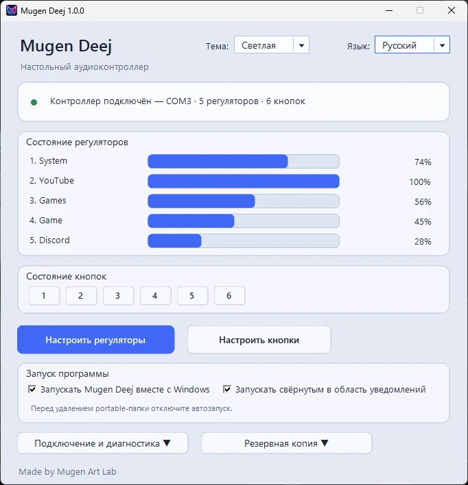
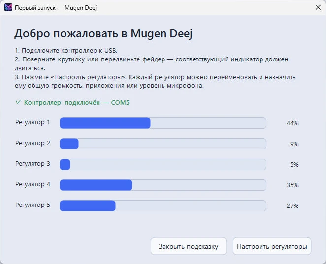
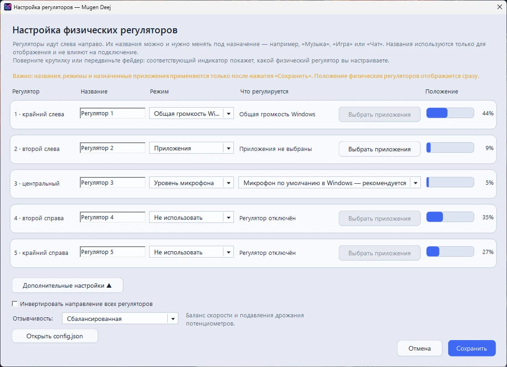
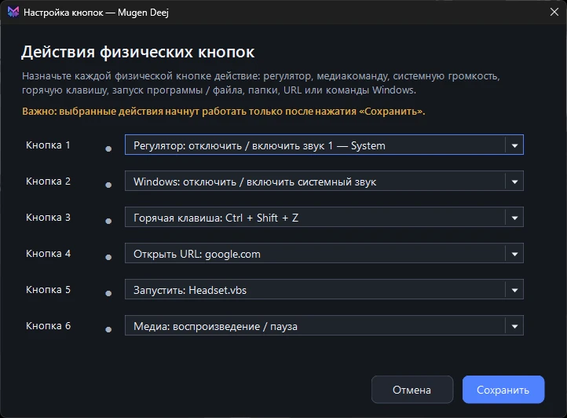
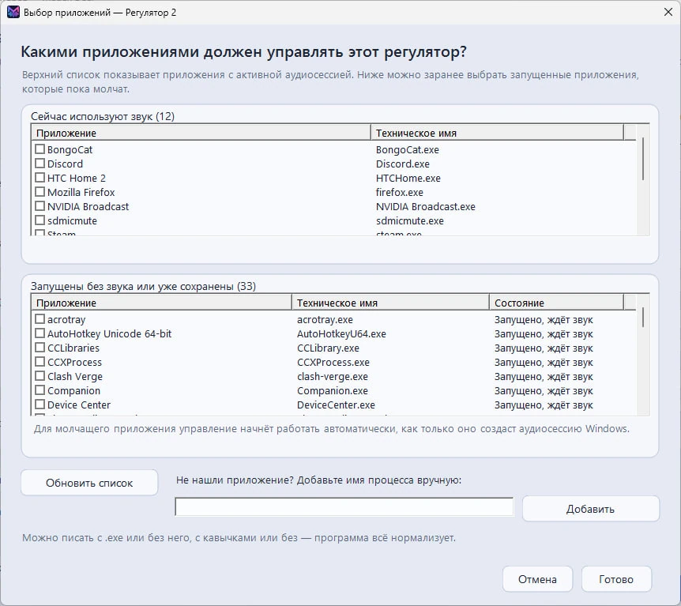
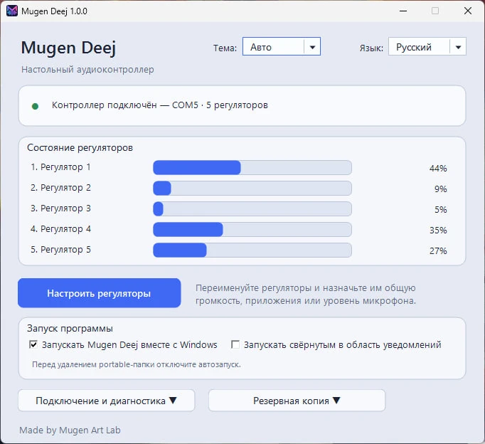

<p align="center">
  
</p>

<h1 align="center">Mugen Deej</h1>

<p align="center">
  Двуязычный Windows-клиент для USB-аудиоконтроллеров, совместимых с deej.
</p>

<p align="center">
  <strong>Русский</strong> · <a href="README.md">English</a>
</p>

<p align="center">
  <a href="assets/screenshots/ru/main-window-extended.webp">
    
  </a>
  <a href="assets/screenshots/ru/main-window-extended-dark.webp">
    
  </a>
</p>

## Связь с оригинальным проектом deej

Mugen Deej — независимо разработанный Windows-клиент, вдохновлённый оригинальным проектом [deej](https://github.com/omriharel/deej), созданным Омри Харелом, и совместимый с его общей аппаратной концепцией и последовательным форматом данных.
Проект использует ту же базовую идею физического микшера и принимает совместимый последовательный формат строк, разделённых переводом строки. Настольный клиент Mugen Deej, интерфейс, диагностика и логика подключения разрабатывались отдельно для этого проекта.
Mugen Deej **не является форком оригинального настольного клиента**, не содержит оригинальный `deej.exe` и не является официальным продолжением либо аффилированным проектом. Полная благодарность и пояснения приведены в [THIRD_PARTY_NOTICES.md](THIRD_PARTY_NOTICES.md).

## Что это такое

Mugen Deej превращает deej-совместимый USB-контроллер с физическими органами управления в понятный настольный микшер громкости Windows.

- Автоматически находит совместимый контроллер среди COM-портов.
- Переподключается после отключения USB, перезапуска платы и смены номера COM.
- Поддерживает автоматическое определение и ручной выбор порта.
- Поддерживает как **Legacy**-контроллеры только с регуляторами, так и **Extended**-контроллеры с дополнительными кнопками.
- Показывает живое положение пяти физических регуляторов по умолчанию.
- Управляет общей громкостью Windows, одним или несколькими приложениями, микрофоном по умолчанию или выбранным устройством ввода.
- Позволяет заранее назначать молчащие приложения до появления их аудиосессии.
- Позволяет назначать кнопкам Extended-контроллера действия: мягкое отключение звука, Play/Pause и запуск файла или программы.
- Может запускаться вместе с Windows и при желании сразу сворачиваться в область уведомлений.
- Содержит темы **Авто, Светлая и Тёмная**; режим Авто следует за изменениями темы Windows прямо во время работы.
- Содержит русский и английский интерфейс и понятное окно первого запуска.
- Позволяет создавать и восстанавливать резервные копии настроек, включая назначения кнопок.
- Объясняет занятые порты, проблемы драйвера и редкие конфликты одинаковых COM-номеров.
- Поставляется как самостоятельный Setup EXE и как portable ZIP.

## Интерфейс

Mugen Deej подстраивает главное окно под обнаруженный контроллер. Extended-прошивка может добавлять кнопки к физическим регуляторам, а Legacy-прошивка сохраняет более простой интерфейс только с регуляторами. Нажмите на изображение, чтобы посмотреть его в полном размере.

### Подсказка при первом запуске

Подключите контроллер, поверните крутилку или передвиньте фейдер — программа сразу покажет, какой физический регулятор обнаружен.

<p align="center">
  <a href="assets/screenshots/ru/first-run.webp">
    
  </a>
</p>

### Настройка физических регуляторов

Переименуйте каждый регулятор и назначьте ему общую громкость Windows, приложения, микрофон либо отключите его.

<p align="center">
  <a href="assets/screenshots/ru/control-settings.webp">
    
  </a>
</p>

### Настройка кнопок Extended-контроллера

Если подключённая прошивка передаёт кнопки, назначьте им мягкое отключение звука, Play/Pause либо запуск файла или программы.

<p align="center">
  <a href="assets/screenshots/ru/button-settings.webp">
    
  </a>
</p>

### Выбор активных и пока молчащих приложений

Выберите приложения с уже созданной аудиосессией либо заранее назначьте запущенные программы до того, как они начнут воспроизводить звук.

<p align="center">
  <a href="assets/screenshots/ru/application-selection.webp">
    
  </a>
</p>

<details>
<summary><strong>Legacy-контроллер без кнопок</strong></summary>
<br>
Mugen Deej автоматически адаптирует интерфейс к обнаруженному протоколу контроллера. Legacy-контроллеры передают только физические регуляторы, а Extended-контроллеры могут дополнительно предоставлять кнопки.
<br><br>
<p align="center">
  <a href="assets/screenshots/ru/main-window-legacy.webp">
    
  </a>
</p>
</details>

<details>
<summary><strong>Выбор языка при первом запуске</strong></summary>
<br>
<p align="center">
  <a href="assets/screenshots/language-selection.webp">
    
  </a>
</p>
</details>

## Скачать

[Скачайте последний релиз](https://github.com/Mugen-Art-Lab/Mugen-Deej/releases/latest).

Для большинства пользователей удобнее **Setup EXE**. Он выполняет portable-установку и не регистрирует Mugen Deej в списке установленных приложений Windows. Если нужен полностью переносимый вариант, в релизе также есть **portable ZIP**, который достаточно распаковать и запустить вручную.

Текущая проверенная сборка: **1.0.0**.

## Протокол контроллера

Mugen Deej автоматически определяет два совместимых формата строковых пакетов с переводом строки на скорости `9600` бод.

**Legacy-формат deej** — только числовые поля:

```text
107|246|536|665|1020
```

Каждое поле — значение одного физического регулятора в диапазоне `0–1023`. Количество числовых полей определяет число обнаруженных регуляторов, поэтому старые slider-only контроллеры deej продолжают работать без перепрошивки.

**Extended-формат с регуляторами и кнопками** — поля с префиксами `s` и `b`:

```text
s512|s123|s900|s456|s777|b1|b1|b0|b1|b1|b1
```

`sN` — значение регулятора в диапазоне `0–1023`. `b1` означает отпущенную кнопку, `b0` — нажатую. Количество регуляторов и кнопок определяется из каждого корректного пакета; отдельный handshake не требуется.

Проверенная эталонная Extended-прошивка находится в [`arduino/MugenDeejController/`](arduino/MugenDeejController/). Её профиль по умолчанию использует пять аналоговых регуляторов и шесть кнопок, передаёт полное состояние, выполняет debounce кнопок в прошивке и сохраняет классическую скорость `9600` бод.

## Быстрый старт

1. Подключите deej-совместимый контроллер по USB.
2. Запустите Setup EXE либо распакуйте portable ZIP и запустите `MugenDeej.exe`.
3. Выберите язык интерфейса.
4. Откройте **«Настроить регуляторы»** и назначьте каждому физическому регулятору нужную функцию.
5. Если обнаружен Extended-контроллер с кнопками, откройте **«Настроить кнопки»** и назначьте действия.

## Структура исходников

- `MugenDeej.ps1` — основное PowerShell/WinForms-приложение: интерфейс, протоколы контроллера, поиск COM-портов, Core Audio, конфигурация, резервное копирование/восстановление, диагностика, трей и автозапуск.
- `arduino/MugenDeejController/` — проверенная эталонная Extended-прошивка контроллера и профиль распиновки.
- `src/launcher/` — небольшой Go-лаунчер, запускающий PowerShell-приложение как Windows GUI EXE.
- `src/setup/` — самостоятельная Go-оболочка Setup и двуязычный PowerShell/WinForms-интерфейс установщика.
- `tools/Build-PortableRelease.ps1` — сборщик portable ZIP, Setup EXE и файлов контрольных сумм SHA-256.
- `tools/patches/` — поэтапные runtime/Setup-патчи, используемые цепочкой упаковки 1.0.0.
- `packaging/` — файлы и шаблоны, которые используются при формировании релизного пакета.
- `config.example.json` — чистый пример конфигурации.
- `docs/` — документация по сборке, диагностике и подготовке релизов.

## Требования

- Windows 10 или Windows 11.
- Windows PowerShell 5.1 или новее.
- USB-контроллер, совместимый с протоколом deej.
- Подходящий драйвер USB–Serial, например CH340/CH341 или FTDI.

## Сборка

Смотрите [docs/BUILDING.md](docs/BUILDING.md). Сборщик релиза создаёт и portable ZIP, и самостоятельный Setup EXE.

## Участие в разработке

Сообщения об ошибках и аккуратные pull request приветствуются. Перед отправкой изменений прочитайте [CONTRIBUTING.md](CONTRIBUTING.md).

## Лицензия

MIT © 2026 MrSoichi / Mugen Art Lab. Подробности: [LICENSE](LICENSE) и [THIRD_PARTY_NOTICES.md](THIRD_PARTY_NOTICES.md).
