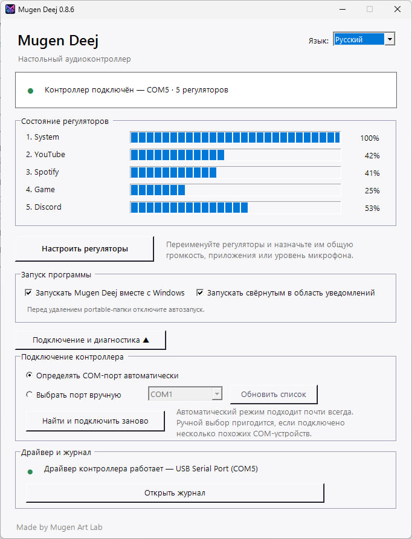
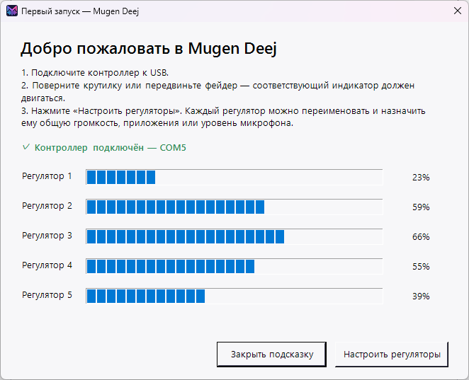
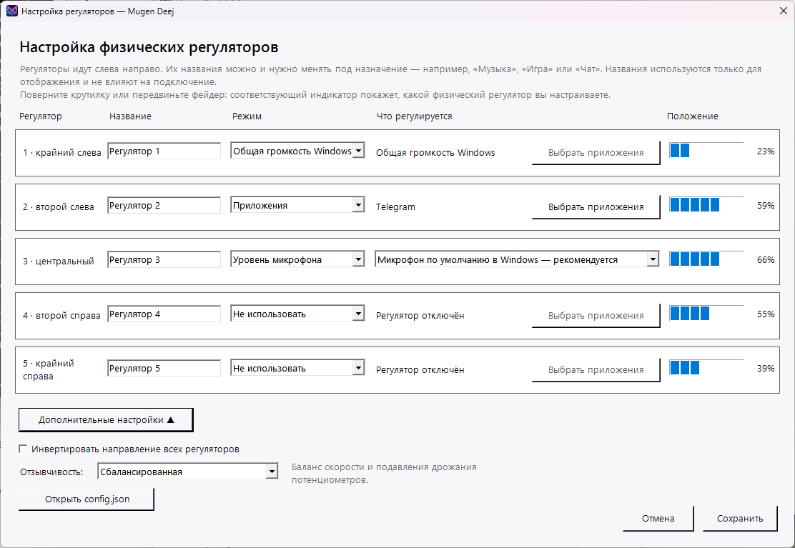
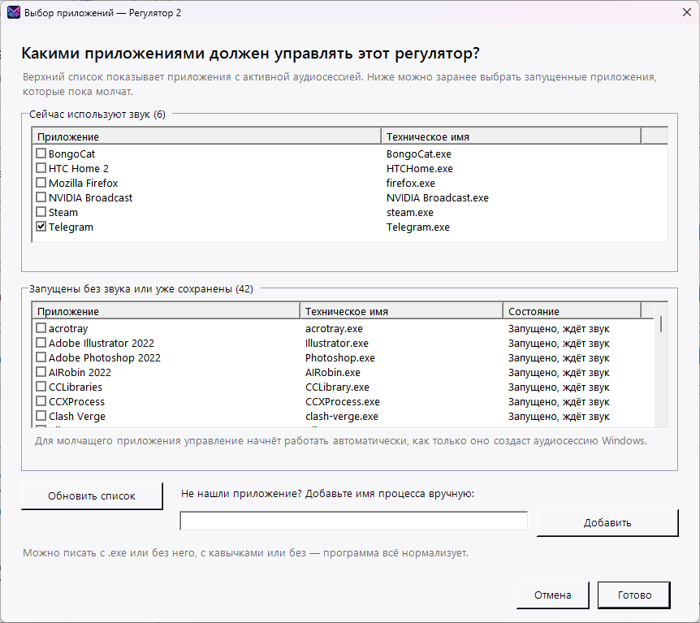
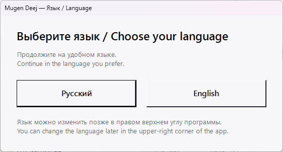

<p align="center">
  
</p>

<h1 align="center">Mugen Deej</h1>

<p align="center">
  Портативный двуязычный Windows-клиент для USB-аудиоконтроллеров, совместимых с deej.
</p>

<p align="center">
  <strong>Русский</strong> · <a href="README.md">English</a>
</p>

<p align="center">
  <a href="assets/screenshots/ru/main-window.png">
    
  </a>
</p>

## Связь с оригинальным проектом deej

Mugen Deej — независимо разработанный Windows-клиент, вдохновлённый оригинальным проектом [deej](https://github.com/omriharel/deej), созданным Омри Харелом, и совместимый с его общей аппаратной концепцией и последовательным форматом данных.

Проект использует ту же базовую идею физического микшера и принимает совместимый последовательный формат строк, разделённых переводом строки. Настольный клиент Mugen Deej, интерфейс, диагностика и логика подключения разрабатывались отдельно для этого проекта.

Mugen Deej **не является форком оригинального настольного клиента**, не содержит оригинальный `deej.exe` и не является официальным продолжением либо аффилированным проектом. Полная благодарность и пояснения приведены в [THIRD_PARTY_NOTICES.md](THIRD_PARTY_NOTICES.md).

## Что это такое

Mugen Deej превращает deej-совместимый USB-контроллер с физическими регуляторами в понятный настольный микшер громкости Windows.

- Автоматически находит совместимый контроллер среди COM-портов.
- Переподключается после отключения USB, перезапуска платы и смены номера COM.
- Поддерживает автоматическое определение и ручной выбор порта.
- Показывает живое положение пяти физических регуляторов по умолчанию.
- Управляет общей громкостью Windows, одним или несколькими приложениями, микрофоном по умолчанию или выбранным устройством ввода.
- Позволяет заранее назначать молчащие приложения до появления их аудиосессии.
- Содержит русский и английский интерфейс и понятное окно первого запуска.
- Объясняет занятые порты, проблемы драйвера и редкие конфликты одинаковых COM-номеров.
- Работает портативно и не требует установки.

## Интерфейс

Главное окно остаётся компактным, а окно первого запуска и экраны настройки последовательно объясняют остальную работу программы. Нажмите на изображение, чтобы посмотреть его в полном размере.

### Подсказка при первом запуске

Подключите контроллер, поверните крутилку или передвиньте фейдер — программа сразу покажет, какой физический регулятор обнаружен.

<p align="center">
  <a href="assets/screenshots/ru/first-run.png">
    
  </a>
</p>

### Настройка физических регуляторов

Переименуйте каждый регулятор и назначьте ему общую громкость Windows, приложения, микрофон либо отключите его.

<p align="center">
  <a href="assets/screenshots/ru/control-settings.png">
    
  </a>
</p>

### Выбор активных и пока молчащих приложений

Выберите приложения с уже созданной аудиосессией либо заранее назначьте запущенные программы до того, как они начнут воспроизводить звук.

<p align="center">
  <a href="assets/screenshots/ru/application-selection.png">
    
  </a>
</p>

<details>
<summary><strong>Выбор языка при первом запуске</strong></summary>
<br>
<p align="center">
  <a href="assets/screenshots/language-selection.png">
    
  </a>
</p>
</details>

## Скачать

[Скачайте последнюю портативную версию](https://github.com/Mugen-Art-Lab/Mugen-Deej/releases/latest), полностью распакуйте архив и запустите `MugenDeej.exe`.

Текущая проверенная сборка: **0.8.4**.

## Протокол контроллера

Контроллер отправляет строки такого вида:

```text
107|246|536|665|1020
```

Стандартная конфигурация ожидает пять значений от `0` до `1023` со скоростью `9600` бод.

## Быстрый старт

1. Подключите deej-совместимый контроллер по USB.
2. Запустите `MugenDeej.exe` из архива релиза.
3. Выберите язык интерфейса.
4. Откройте **«Настроить регуляторы»** и назначьте каждому физическому регулятору нужную функцию.

## Структура исходников

- `MugenDeej.ps1` — интерфейс, поиск COM-портов, управление Core Audio и диагностика.
- `src/launcher/` — небольшой Go-лаунчер для Windows-исполняемого файла.
- `config.example.json` — чистый пример конфигурации.
- `docs/` — сборка, диагностика и заметки к релизу.

## Требования

- Windows 10 или Windows 11.
- Windows PowerShell 5.1 или новее.
- USB-контроллер, совместимый с протоколом deej.
- Подходящий драйвер USB–Serial, например CH340/CH341 или FTDI.

## Сборка

Смотрите [docs/BUILDING.md](docs/BUILDING.md). Текущий портативный релиз содержит лаунчер с фирменной иконкой, встроенной в EXE.

## Участие в разработке

Сообщения об ошибках и аккуратные pull request приветствуются. Перед отправкой изменений прочитайте [CONTRIBUTING.md](CONTRIBUTING.md).

## Лицензия

MIT © 2026 MrSoichi / Mugen Art Lab. Подробности: [LICENSE](LICENSE) и [THIRD_PARTY_NOTICES.md](THIRD_PARTY_NOTICES.md).
