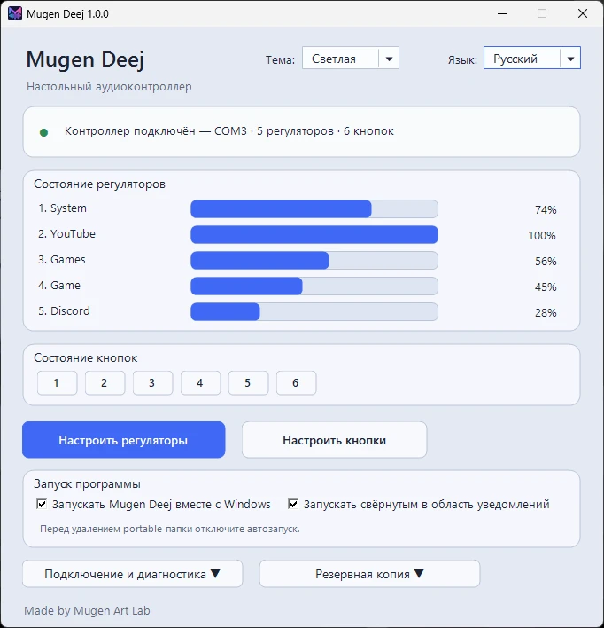
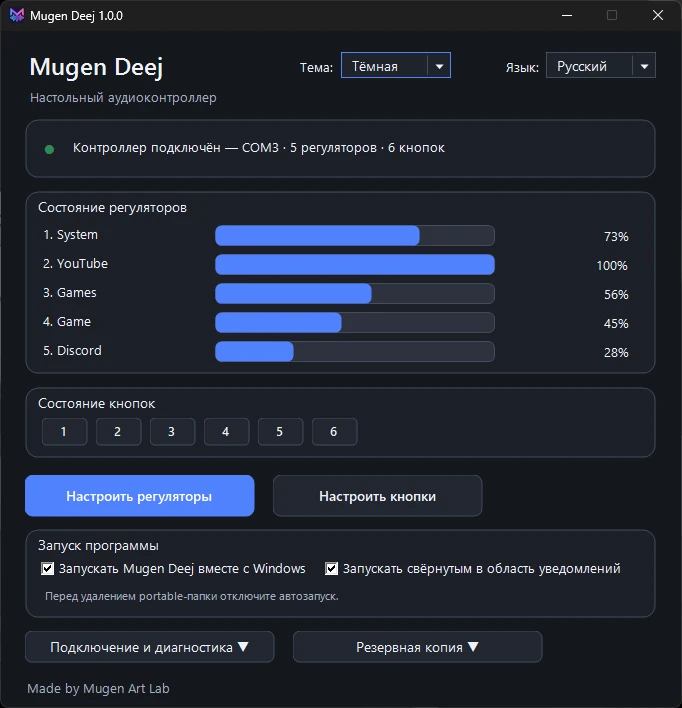
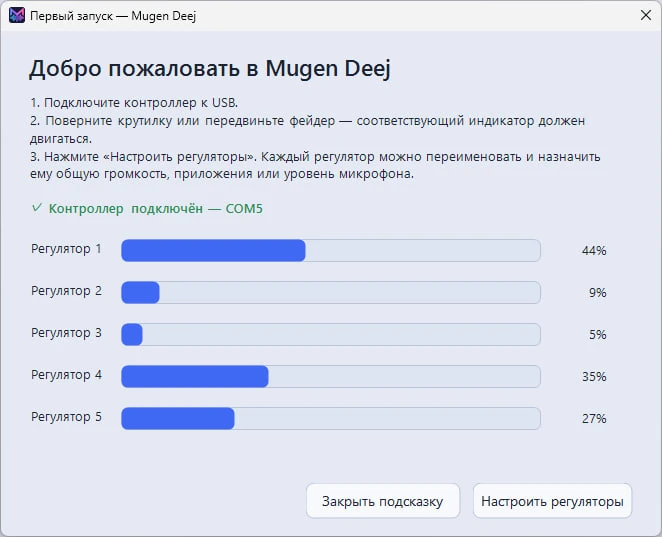
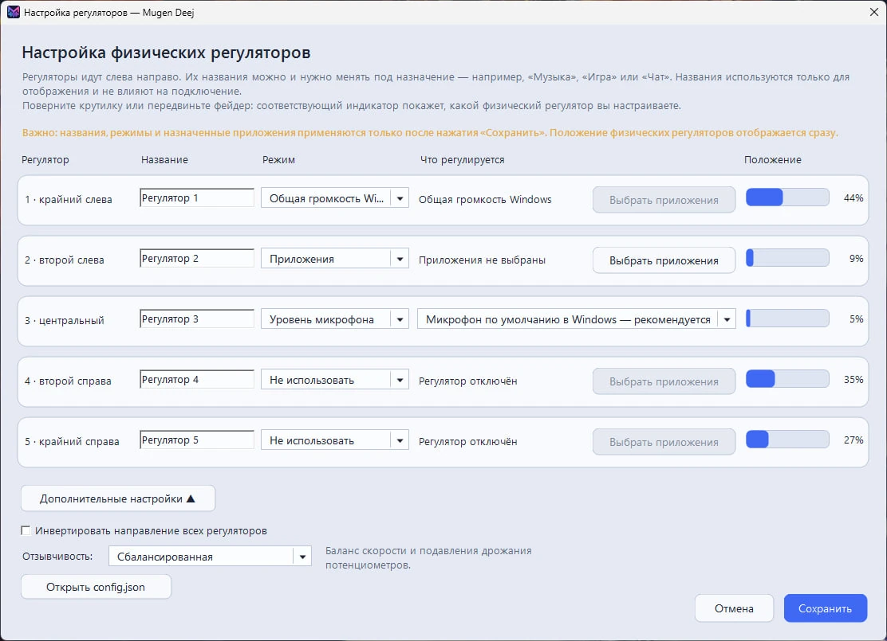
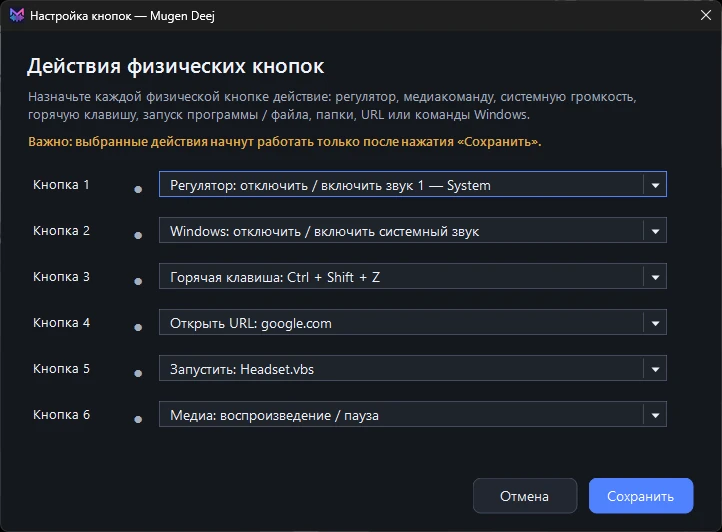
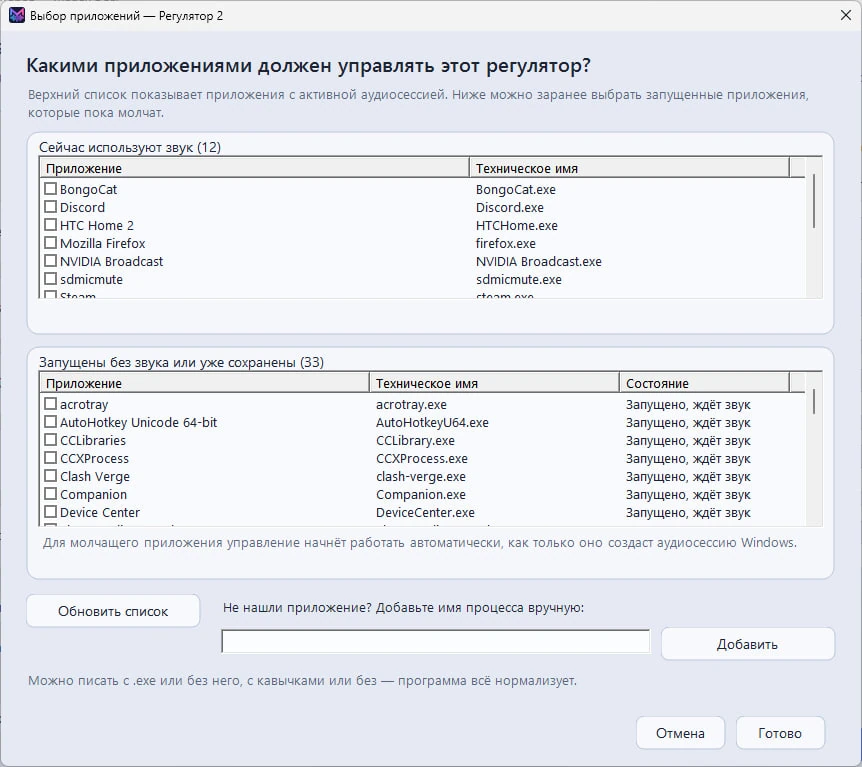
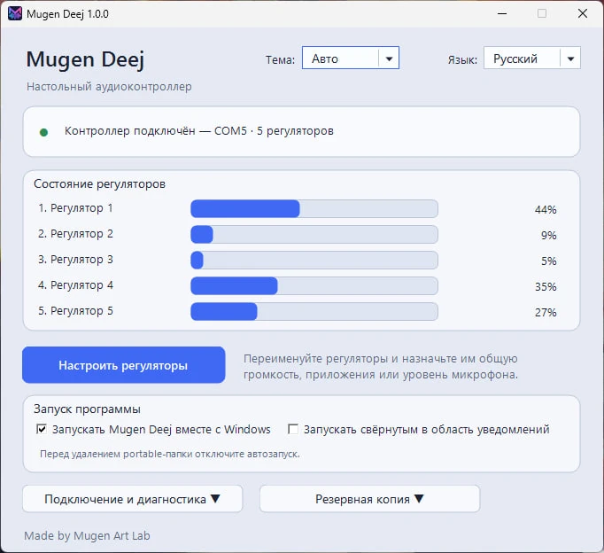

<p align="center">
  
</p>

<h1 align="center">Mugen Deej</h1>

<p align="center">
  Двуязычное приложение для Windows и USB-контроллеров, совместимых с deej.
</p>

<p align="center">
  <strong>Русский</strong> · <a href="README.md">English</a>
</p>

<p align="center">
  <a href="assets/screenshots/ru/main-window-extended.webp">
    
  </a>
  <a href="assets/screenshots/ru/main-window-extended-dark.webp">
    
  </a>
</p>

## Связь с оригинальным проектом deej

Mugen Deej — самостоятельное приложение для Windows, вдохновлённое оригинальным проектом [deej](https://github.com/omriharel/deej) Омри Харела и совместимое с его общей аппаратной концепцией и форматом обмена данными по последовательному порту.
Проект использует ту же базовую идею физического микшера и принимает совместимый последовательный формат строк, разделённых переводом строки. Настольный клиент Mugen Deej, интерфейс, диагностика и логика подключения разрабатывались отдельно для этого проекта.
Mugen Deej **не является форком оригинального настольного клиента**, не содержит оригинальный `deej.exe` и не является официальным продолжением либо аффилированным проектом. Полная благодарность и пояснения приведены в [THIRD_PARTY_NOTICES.md](THIRD_PARTY_NOTICES.md).

## Что это такое

Mugen Deej превращает deej-совместимый USB-контроллер в удобную настольную панель управления звуком Windows, приложениями и другими действиями.

- Автоматически находит совместимый контроллер среди COM-портов.
- Переподключается после отключения USB, перезапуска платы и смены номера COM.
- Поддерживает автоматическое определение и ручной выбор порта.
- Поддерживает **Legacy**, **Extended** и самодокументируемые контроллеры **Adaptive v3**.
- Показывает живое положение аналоговых регуляторов и подстраивает интерфейс под обнаруженную топологию контроллера.
- Управляет общей громкостью Windows, одним или несколькими приложениями, микрофоном по умолчанию или выбранным устройством ввода.
- Позволяет заранее назначать запущенные приложения ещё до того, как они начнут воспроизводить звук.
- Позволяет назначать физическим кнопкам действия: мягкое отключение звука, медиа-команды, горячие клавиши, запуск файлов/программ и другое.
- Может запускаться вместе с Windows и при желании сразу сворачиваться в область уведомлений.
- Содержит темы **Авто, Светлая и Тёмная**; режим Авто следует за изменениями темы Windows прямо во время работы.
- Содержит русский и английский интерфейс и понятное окно первого запуска.
- Adaptive v3 добавляет действия для тумблеров и энкодеров, профили приложений, слои управления и необязательный виртуальный Xbox 360 / XInput-геймпад.
- Использует единый формат резервных копий v3 для основных настроек, кнопок, Adaptive-настроек, слоёв и виртуального контроллера.
- Доступен в виде Setup EXE и portable ZIP-архива.

## Интерфейс

Mugen Deej подстраивает главное окно под обнаруженный контроллер. Legacy сохраняет простой интерфейс только с регуляторами, Extended может добавлять кнопки, а Adaptive v3 — регуляторы, кнопки, тумблеры и энкодеры. Нажмите на изображение, чтобы посмотреть его в полном размере.

### Подсказка при первом запуске

Подключите контроллер, поверните крутилку или передвиньте фейдер — программа сразу покажет, какой физический регулятор обнаружен.

<p align="center">
  <a href="assets/screenshots/ru/first-run.webp">
    
  </a>
</p>

### Настройка физических регуляторов

Переименуйте каждый регулятор и назначьте ему общую громкость Windows, приложения, микрофон либо отключите его.

<p align="center">
  <a href="assets/screenshots/ru/control-settings.webp">
    
  </a>
</p>

### Настройка действий физических кнопок

Если подключённая прошивка передаёт кнопки, назначьте им обычные действия Windows или опциональные команды виртуального Xbox 360 / XInput-геймпада.

<p align="center">
  <a href="assets/screenshots/ru/button-settings.webp">
    
  </a>
</p>

### Выбор приложений сейчас или заранее

Выберите приложения, которые уже воспроизводят звук, или заранее назначьте запущенные программы — управление начнёт работать автоматически, когда у них появится аудиосессия.

<p align="center">
  <a href="assets/screenshots/ru/application-selection.webp">
    
  </a>
</p>

<details>
<summary><strong>Legacy-контроллер без кнопок</strong></summary>
<br>
Mugen Deej автоматически адаптирует интерфейс к обнаруженному протоколу контроллера. Legacy-контроллеры передают только физические регуляторы, а Extended-контроллеры могут дополнительно предоставлять кнопки.
<br><br>
<p align="center">
  <a href="assets/screenshots/ru/main-window-legacy.webp">
    
  </a>
</p>
</details>

<details>
<summary><strong>Выбор языка при первом запуске</strong></summary>
<br>
<p align="center">
  <a href="assets/screenshots/language-selection.webp">
    
  </a>
</p>
</details>

## Скачать

[Скачайте последний релиз](https://github.com/Mugen-Art-Lab/Mugen-Deej/releases/latest).

Mugen Deej остаётся полностью портативной программой. Для удобства **Setup EXE** просто распаковывает те же файлы в выбранную папку, при желании создаёт ярлык на рабочем столе и может сразу запустить Mugen Deej. **Portable ZIP-архив** содержит тот же набор файлов для ручной распаковки.

Последний публичный стабильный релиз: **1.0.0**. Версия **2.0.0** сейчас готовится к выпуску после RC1 и аппаратной проверки на реальном контроллере.

### Windows SmartScreen / неподписанные сборки

Для текущего релизного пути 2.0 пока нет Authenticode-сертификата подписи кода.
Поэтому Windows может показать **«Неизвестный издатель»** или предупреждение
Microsoft Defender SmartScreen для Setup EXE/лаунчера.

Скачивайте релизные файлы только со страницы GitHub Releases этого репозитория
и перед запуском сверяйте предоставленную SHA-256 контрольную сумму. Сообщение
о неизвестном издателе означает отсутствие доверенной цифровой подписи и само
по себе не заменяет проверку источника файла.

## Протокол контроллера

Mugen Deej поддерживает три поколения протокола контроллера. Legacy и Extended работают на `9600` бод, а самодокументируемый Adaptive v3 — на `115200` бод.

**Legacy-формат deej** — только числовые поля:

```text
107|246|536|665|1020
```

Каждое поле — значение одного физического регулятора в диапазоне `0–1023`. Количество числовых полей определяет число обнаруженных регуляторов, поэтому старые slider-only контроллеры deej продолжают работать без перепрошивки.

**Extended-формат с регуляторами и кнопками** — поля с префиксами `s` и `b`:

```text
s512|s123|s900|s456|s777|b1|b1|b0|b1|b1|b1
```

`sN` — значение регулятора в диапазоне `0–1023`. `b1` означает отпущенную кнопку, `b0` — нажатую. Количество регуляторов и кнопок определяется из каждого корректного пакета; отдельный handshake не требуется.

Проверенная эталонная Extended-прошивка находится в [`arduino/MugenDeejController/`](arduino/MugenDeejController/). Её профиль по умолчанию использует пять аналоговых регуляторов и шесть кнопок, передаёт полное состояние, подавляет дребезг кнопок в прошивке и сохраняет классическую скорость `9600` бод.

**Adaptive v3** — типизированные самодокументируемые пакеты, начинающиеся с `v3`:

```text
v3|s...|b...|t...|e...
```

Adaptive v3 может передавать любое поддерживаемое сочетание регуляторов, моментальных кнопок, фиксируемых тумблеров и энкодеров с накопительной позицией. Топология определяется из самого пакета, поэтому проверенная панель 5/28/2/1 не зашита в приложение. Текущая эталонная прошивка Cardboard Nano работает на `115200` бод.

Документация эталонной сборки: [обзор Adaptive v3](docs/ADAPTIVE_V3.md) · [распиновка и подключение Nano](docs/ADAPTIVE_V3_WIRING.md) · [прошивка и аппаратная проверка](docs/ADAPTIVE_V3_BUILD.md) · [подробности протокола](docs/PROTOCOL.md).

## Быстрый старт

1. Подключите deej-совместимый контроллер по USB.
2. Запустите Setup EXE либо распакуйте portable ZIP-архив и откройте `MugenDeej.exe`.
3. Выберите язык интерфейса.
4. Откройте **«Регуляторы»** и настройте физические ползунки.
5. Для обнаруженных цифровых элементов используйте **«Кнопки»** и **«Тумблеры и энкодеры»**. Adaptive-контроллеры дополнительно поддерживают профили приложений, слои управления и опциональный виртуальный геймпад Xbox.

## Структура исходников

- `MugenDeej.ps1` — основное PowerShell/WinForms-приложение: интерфейс, протоколы контроллера, поиск COM-портов, Core Audio, конфигурация, резервное копирование/восстановление, диагностика, трей и автозапуск.
- `arduino/MugenDeejController/` — проверенная эталонная Extended-прошивка контроллера и профиль распиновки.
- `arduino/MugenDeejCardboardNanoPrototype/` — аппаратно проверенная эталонная Adaptive v3 прошивка Nano 5/28/2/1 (имя каталога историческое).
- `src/launcher/` — небольшой Go-лаунчер, запускающий PowerShell-приложение как Windows GUI EXE.
- `src/setup/` — самостоятельная Go-оболочка Setup и двуязычный PowerShell/WinForms-интерфейс распаковки.
- `tools/Build-Release.ps1` — сборщик portable ZIP-архива, Setup EXE и файлов с контрольными суммами SHA-256.
- `packaging/` — файлы и шаблоны, которые используются при формировании релизного пакета.
- `config.example.json` — чистый пример конфигурации.
- `docs/` — документация по сборке, диагностике, истории разработки и релизам.

## Требования

- Windows 10 или Windows 11.
- Windows PowerShell 5.1 или новее.
- USB-контроллер, совместимый с протоколом deej.
- Подходящий драйвер USB–Serial, например CH340/CH341 или FTDI.

## Сборка

Смотрите [docs/BUILDING.md](docs/BUILDING.md). Сборщик релиза создаёт portable ZIP-архив и самостоятельный Setup EXE.

## Участие в разработке

Сообщения об ошибках и аккуратные pull request приветствуются. Перед отправкой изменений прочитайте [CONTRIBUTING.md](CONTRIBUTING.md).

## Лицензия

MIT © 2026 MrSoichi / Mugen Art Lab. Подробности: [LICENSE](LICENSE) и [THIRD_PARTY_NOTICES.md](THIRD_PARTY_NOTICES.md).
